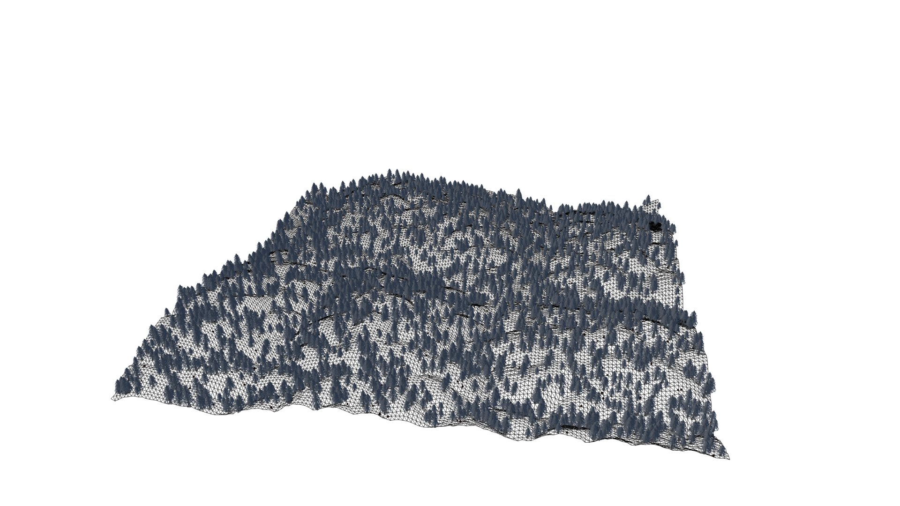

# Three.js Infinite terrain generation

[This website](https://infinite-landscape.vercel.app/) is a demo of the infinite terrain generation algorithm I developed for a university project.

## How it works
### Terrain

The algorithm uses perlin noise to generate a heightmap that is used to displace the vertices of a plane geometry. On each frame the noise is shifted to create the illusion of movement.

$~$
### Camera

For performance reasons the camera is not moved but the terrain is moving towards the camera. The camera is moved only on the z axis to follow the shape of the terrain. The height of the camera is calculated based on the noise that is used to displace the vertices of the terrain, not in the location of the camera but in front of it.

$~$
### Instancing

The landscape is populated with two models. Each model is loaded only once and then instanced. On each frame the matrices of the instances are updated with the same offset of the noise to create the illusion of movement.

$~$

---

$~$

